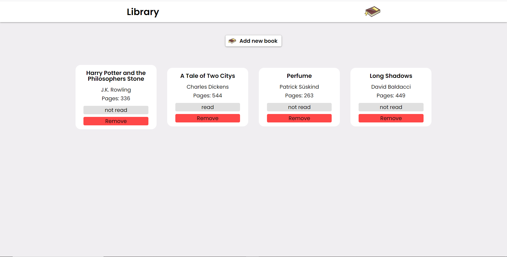
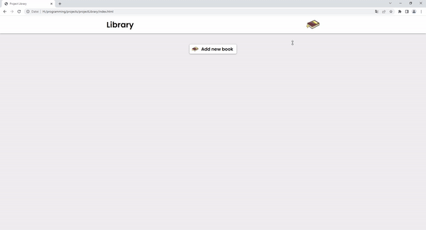

<h1 align="center">Project Library</h1>

------
## Short description
----
Project Library is a web application that lets you display book cards with the book title, the author, the number of pages and wether you've read the book or not. Thats allows you to save books that you've read or display books that you still want to read. An added book can easily be removed and the information wether you've read the book or not can be changed with a click on the information.

## Live page
---
Click the link to see the [live page](https://dannyruda.github.io/projectLibrary/)

## Demo Video
---

Showcases some example features

## Motivation
---
I build this project to reinforce my understanding of the newly learned object concepts in JavaScript and refresh my knowledge of DOM manipulation with JavaScript after not coding for roughly 2 months due to moving and other reasons.

## Technologies used
---
- JavaScript
- CSS3
- HTML 5